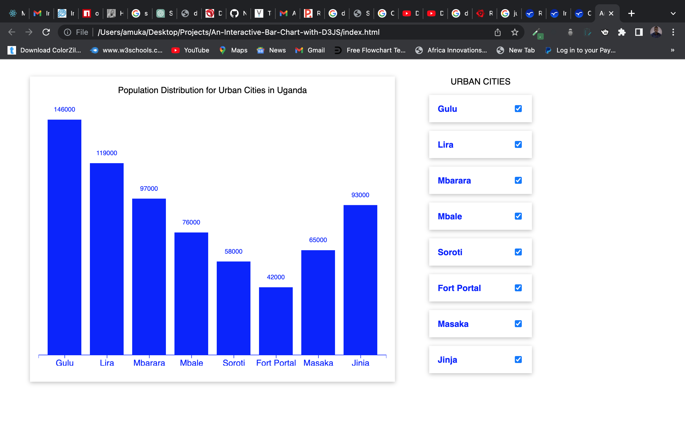

# Bar Chart with D3js

## Task
This is a bar chart I developed using a JavaScript Visualization Library called D3Js. It's an amazing data visualization tool with your imagination as your limit

## Technology
- HTML
- CSS
- D3JS

## Live Demo
 Url: https://amukayoung.github.io/An-Interactive-Bar-Chart-with-D3JS/

 ## Usage

